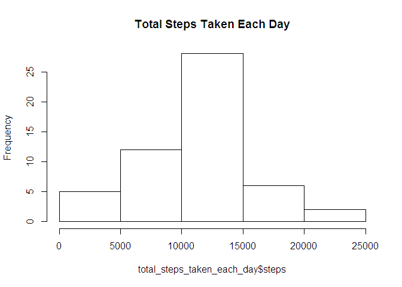
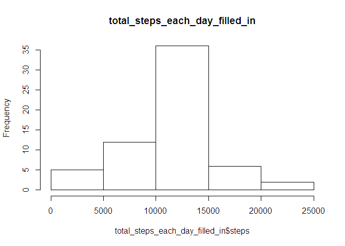
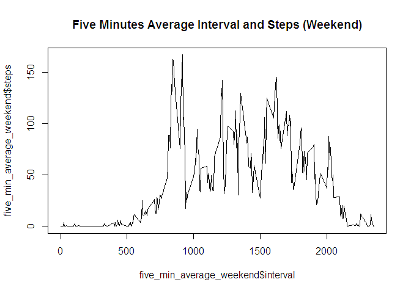

# Reproducible Research Project 1
Lee Siow Wei  
April 11, 2017  


1. Load the data (i.e. read.csv)

I downloaded and unziped the file from the Cousera Site, saved the "activity.csv" data on Hard disk "D".


```r
## Loading the Dataset
activity = read.csv("D:/Coursera/activity.csv")
```

2. Process/transform the data (if necessary) into a format suitable for your analysis

It was not needed to process/transform the data.

3. What is mean total number of steps taken per day?

Calculate the total number of steps taken per day.


```r
total_of_steps_taken_per_day <- sum(activity$steps, na.rm = TRUE)
total_of_steps_taken_per_day
```

```
## [1] 570608
```

4. Make a histogram of the total number of steps taken each day


```r
## Calculate the total number of steps taken each day and stored in a new variable called "total_steps_taken_each_day"
total_steps_taken_each_day <- aggregate(steps~date, data=activity, FUN=sum, na.rm=TRUE)
## Generate the Histogram by each day
hist(total_steps_taken_each_day$steps, main="Total Steps Taken Each Day")
```

<!-- -->

5. Calculate and report the mean and median of the total number of steps taken per day


```r
## Calculate the mean
total_steps_taken_each_day_mean <- mean(total_steps_taken_each_day$steps)
total_steps_taken_each_day_mean
```

```
## [1] 10766.19
```

```r
## Calculate the median
total_steps_taken_each_day_median <- median(total_steps_taken_each_day$steps)
total_steps_taken_each_day_median
```

```
## [1] 10765
```

6. What is the average daily activity pattern?

a. Make a time series plot (i.e. type = "l") of the 5-minute interval (x-axis) and the average number of steps taken, averaged across all days (y-axis)

```r
## create a dataframe with the mean of each 5-minute interval and use the funtion plot() to make the time series plot
five_min_average <- aggregate(steps~interval, data=activity, FUN=mean, na.rm=TRUE)
plot(x = five_min_average$interval, y = five_min_average$steps, type = "l", main="Five Minutes Average Activity Pattern")
```

<!-- -->

b. Which 5-minute interval, on average across all the days in the dataset, contains the maximum number of steps?

```r
## use the funtions max() to find the maximum number of steps and a for{} loop to find the 5 minute interval with maximum number of steps
max_steps <- max(five_min_average$steps)
for (i in 1:288) 
{
    if (five_min_average$steps[i] == max_steps)
        five_min_interval_at_max_steps <- five_min_average$interval[i]
}
five_min_interval_at_max_steps
```

```
## [1] 835
```

7. Input missing value

a. Calculate and report the total number of missing values in the dataset (i.e. the total number of rows with NAs)

```r
## create a new variable called "total_missing" to store the total missing values in the dataset
total_missing <- 0
for (i in 1:17568)
{
    if(is.na(activity$steps[i])) 
        total_missing <- total_missing+1 
}
total_missing
```

```
## [1] 2304
```
b. Devise a strategy for filling in all of the missing values in the dataset. The strategy does not need to be sophisticated. For example, you could use the mean/median for that day, or the mean for that 5-minute interval, etc.

The strategy will be to fill in the dataset the with the mean of that 5 minute interval

c. Create a new dataset that is equal to the original dataset but with the missing data filled in.

Use a pointer to find the "na" is created a new dataset (activity_filled_in), copy the original dataset. When is finding a "na" is stored in pointer the position of 'na' to replace it with the mean value of that 5 minute interval.


```r
activity_filled_in <- activity
for (i in 1:17568) # loop to find the na
{
    if(is.na(activity_filled_in$steps[i])) # if steps is na store the pointer 
    { 
        five_minute_pointer <- activity_filled_in$interval[i] #store the value of pointer to find the mean on five minute interval
        for (j in 1:288)  # loop to find the value of pointer on the data frame of five minute interval
        {
            if (five_min_average$interval[j] == five_minute_pointer) # finding the value of mean of five minute interval data frame
                activity_filled_in$steps[i] <- five_min_average$steps[j] # replacing the na by the mean in that fime minute interval 

        }
    }
}
```

d. Make a histogram of the total number of steps taken each day and Calculate and report the mean and median total number of steps taken per day. Do these values differ from the estimates from the first part of the assignment? What is the impact of imputing missing data on the estimates of the total daily number of steps?

7d.i - Make a histogram of the total number of steps taken each day

```r
## Calculate the total number of steps taken each day and stored in a variable
total_steps_each_day_filled_in <- aggregate(steps~date, data=activity_filled_in, FUN=sum, na.rm=TRUE)
## Generate a Histogram by each day with new dataset (activity_filled_in)
hist(total_steps_each_day_filled_in$steps, main="total_steps_each_day_filled_in")
```

<!-- -->

7e. Calculate the mean and median and explain the impact of imputing missing data on the estimates of the total daily number of steps


```r
## use function mean
total_steps_each_day_mean_filled_in <- mean(total_steps_each_day_filled_in$steps)
total_steps_each_day_mean_filled_in
```

```
## [1] 10766.19
```

```r
##  use function median
total_steps_each_day_median_filled_in <- median(total_steps_each_day_filled_in$steps)
total_steps_each_day_median_filled_in
```

```
## [1] 10766.19
```

Final answer : The use of mean value as new estimates did not change the mean and the use of mean value as new estimates of median changed more close to the mean.

8. Are there differences in activity patterns between weekdays and weekends?


```r
## load the package lubridate
library(lubridate)
```

```
## 
## Attaching package: 'lubridate'
```

```
## The following object is masked from 'package:base':
## 
##     date
```

```r
week <- wday(activity_filled_in$date)
week_day <- week
for (i in 1:17568) # loop to find the na
{
    if(week[i] == 1)
        week_day[i] <- 'weekend'
    if(week[i] == 2)
        week_day[i] <- 'weekday'
    if(week[i] == 3)
        week_day[i] <- 'weekday'
    if(week[i] == 4)
        week_day[i] <- 'weekday'
    if(week[i] == 5)
        week_day[i] <- 'weekday'
    if(week[i] == 6)
        week_day[i] <- 'weekday'
    if(week[i] == 7)
        week_day[i] <- 'weekend'
}

## create a new factor variable in the dataset "activity_filled_in" 
activity_filled_in$weekday <-week_day
```

9. Make a panel plot containing a time series plot (i.e. type = "l") of the 5-minute interval (x-axis) and the average number of steps taken, averaged across all weekday days or weekend days (y-axis).


```r
## find the elements by "weekday" or "weekend"
weekday <- grep("weekday",activity_filled_in$weekday)
weekday_frame <- activity_filled_in[weekday,]
weekend_frame <- activity_filled_in[-weekday,]

## What is the average daily activity pattern?

## Make a time series plot of the 5-minute interval (x-axis) and the average number of steps taken, 
## averaged across all days (yaxis)
five_min_average_weekday <- aggregate(steps~interval, data=weekday_frame, FUN=mean, na.rm=TRUE)
five_min_average_weekend <- aggregate(steps~interval, data=weekend_frame, FUN=mean, na.rm=TRUE)

plot(x = five_min_average_weekday$interval, y = five_min_average_weekday$steps, type = "l", main="Five Minutes Average Interval and Steps (Weekday)")
```

<!-- -->

```r
plot(x = five_min_average_weekend$interval, y = five_min_average_weekend$steps, type = "l", main="Five Minutes Average Interval and Steps (Weekend)")
```

<!-- -->

